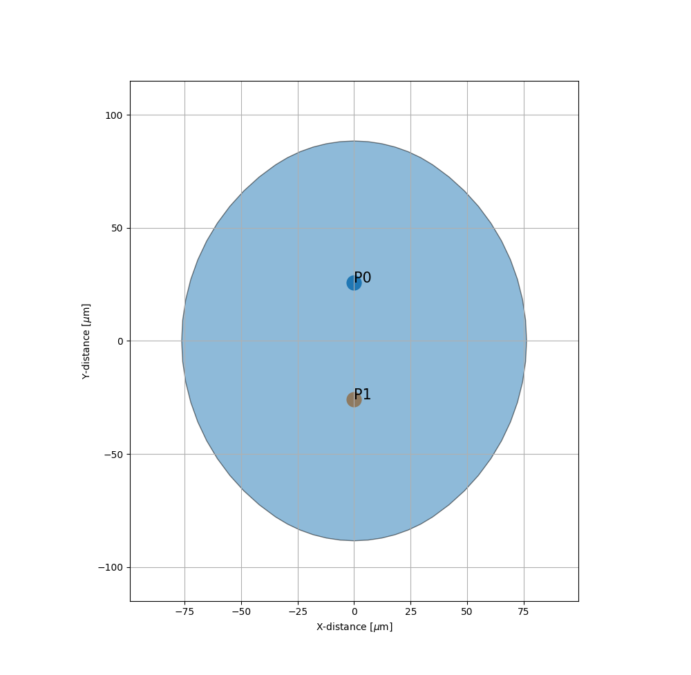
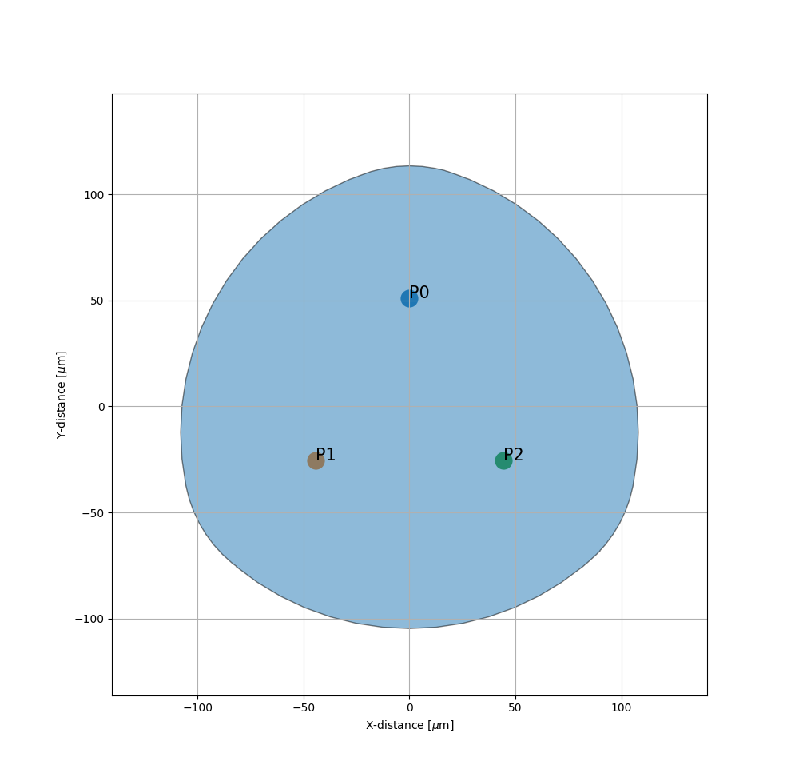
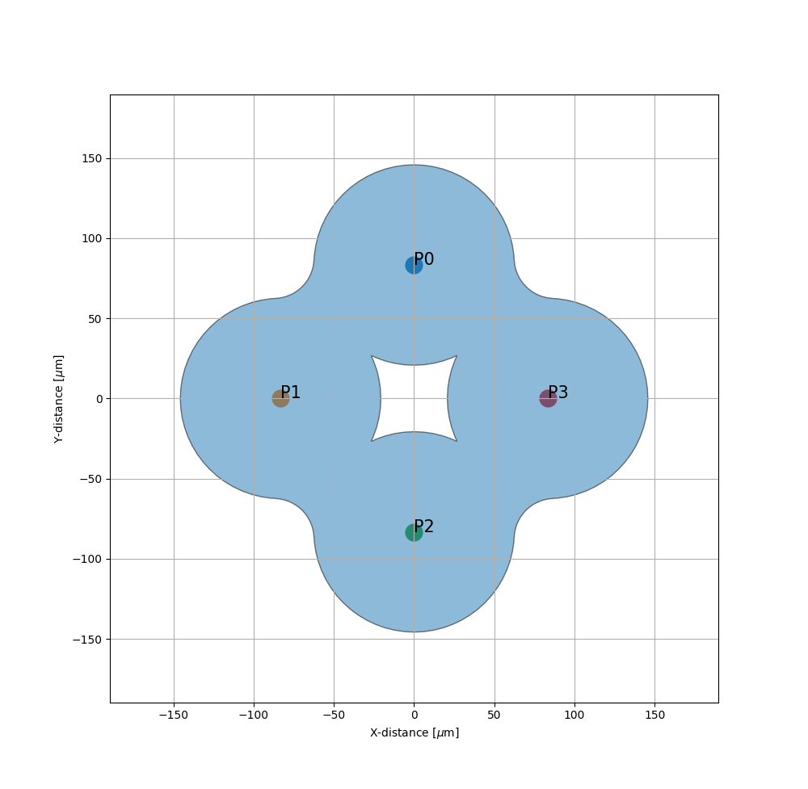

Examples
========

.. literalinclude:: ../../examples/Geometry:2x2Coupler.py
    :language: python
    :caption: **Scatterer: Index**
    :lines: 1-
    :linenos:

.. literalinclude:: ../../examples/Geometry:3x3Coupler.py
    :language: python
    :caption: **Scatterer: Index**
    :lines: 1-
    :linenos:

.. literalinclude:: ../../examples/Geometry:4x4Coupler.py
    :language: python
    :caption: **Scatterer: Index**
    :lines: 1-
    :linenos:

